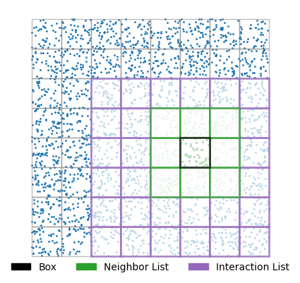
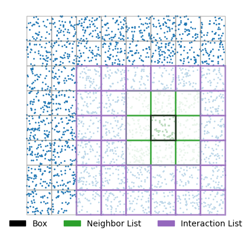

# skelFMM

[](https://doi.org/10.5281/zenodo.14613532)
[](./LICENSE)
[](https://github.com/annayesy/skelFMM/commits/main)
[](https://www.python.org)

A kernel-independent FMM without interaction lists.

The public package is built around explicit kernel/operator objects, a
geometry-agnostic tree/skeletonization core, and GPU-friendly batched applies
through PyTorch and PyKeOps when available.

This repository implements the method from Anna Yesypenko, Chao Chen, and
Per-Gunnar Martinsson, "A simplified fast multipole method based on strong
recursive skeletonization," Journal of Computational Physics 524 (2025),
Article 113707. DOI: [10.1016/j.jcp.2024.113707](https://doi.org/10.1016/j.jcp.2024.113707)

## Interaction structure

<p align="center">
  
  
</p>

These figures illustrate the local interaction structure on square and curvy
annulus geometries and the localized interaction patterns used by the method.

## Overview

`skelFMM` is a research implementation of a novel kernel-independent fast
multipole method (FMM) for efficiently evaluating discrete kernel interactions
with given source distributions. This method introduces a
simplified approach that eliminates the need for explicit interaction lists by
leveraging near-neighbor computations at each level of an adaptive tree
structure. The algorithm is well-suited for parallelization on modern hardware
and supports a wide range of kernels.

Unlike traditional FMM implementations, `skelFMM` simplifies data structures
by operating exclusively on the near-neighbor list rather than the interaction
list. This makes the implementation lightweight and efficient while retaining
full compatibility with adaptive quad-tree and octree structures. The method
also introduces novel translation operators to handle adaptive point
distributions effectively.

The current package exposes that method through explicit operator objects, a
geometry-agnostic skeletonization core, and GPU-friendly batched apply paths
through PyTorch and PyKeOps when available.

## Citation

If you use `skelFMM` in your research, please cite:

```bibtex
@article{yesypenko2025simplified,
  title={A simplified fast multipole method based on strong recursive skeletonization},
  author={Yesypenko, Anna and Chen, Chao and Martinsson, Per-Gunnar},
  journal={Journal of Computational Physics},
  volume={524},
  pages={113707},
  year={2025},
  publisher={Elsevier}
}
```

## Quick start

For most users, the fastest way to get oriented is:

```bash
python -m pip install -e .
python -m skelfmm.examples.example_laplace_curvy_annulus
python -m skelfmm.examples.example_helmholtz_cube
python -m skelfmm.examples.example_sphere_adjoint_double_layer_kernel
python -m skelfmm.examples.driver_single_layer_kernels --geom square --rank_or_tol 1e-5 --N 1000000
```

For direct use from Python:

```python
import numpy as np
from skelfmm import SkelFMM, operators

points = np.random.default_rng(0).random((100_000, 2))
fmm = SkelFMM(points, operators.LAPLACE_2D, tol=1e-5, leaf_size=200)
random = np.random.RandomState(1)
x = random.randn(points.shape[0])
y = fmm.apply(x)
```

Use `fmm.build()` if you want to time setup explicitly. Otherwise the first
`apply()` builds the compressed operator automatically and later applies reuse
that build.

If you are starting fresh, begin with:

- `SkelFMM` for building and applying an operator
- `skelfmm.operators` for the built-in kernels
- `python -m skelfmm.examples.example_laplace_curvy_annulus`
- `python -m skelfmm.examples.driver_single_layer_kernels --help`

## Installation

For local development on CPU:

```bash
conda env create -f environment.yml
conda activate skelfmmenv
```

For CUDA machines:

```bash
conda env create -f environment-gpu.yml
conda activate skelfmmenv-gpu
```

Both environments install:

- the local `skelfmm` package in editable mode
- the `simpletree` dependency
- `torch`
- `pykeops`

The CPU environment uses a CPU-only PyTorch wheel. The GPU environment uses the
CUDA 12.1 PyTorch wheel index and is the recommended starting point for NVIDIA
machines. It also installs the CUDA runtime and NVRTC wheels that PyKeOps
needs for GPU JIT compilation.

For a plain editable install without Conda:

```bash
python -m pip install -e .[dev]
```

## Package layout

The public package code now lives in `skelfmm/`.

- `skelfmm/skel_fmm.py`: public fast-apply wrapper
- `skelfmm/recursive_skel.py`: core recursive skeletonization implementation
- `skelfmm/batched_fmm.py`: batched torch implementation
- `skelfmm/operators.py`: explicit kernel/operator objects
- `skelfmm/util.py`: scalar kernels and skeletonization helpers
- `skelfmm/util_batched.py`: batched kernel helpers
- `skelfmm/examples/`: packaged examples and convergence studies

The mainline package path is the single-layer FMM/apply workflow together with
the packaged sphere kernel convergence studies.

## Operator API

The package expects explicit operator objects rather than raw kernel callables.
The main built-ins live in `skelfmm.operators`, for example:

- `operators.LAPLACE_2D`
- `operators.LAPLACE_3D`
- `operators.HELMHOLTZ_2D`
- `operators.HELMHOLTZ_3D`
- `operators.LAPLACE_DOUBLE_LAYER_3D`
- `operators.LAPLACE_ADJOINT_DOUBLE_LAYER_3D`
- `operators.HELMHOLTZ_DOUBLE_LAYER_3D`
- `operators.HELMHOLTZ_ADJOINT_DOUBLE_LAYER_3D`

The Laplace and Helmholtz double-layer examples use the same operator
infrastructure, with geometry passed separately from the operator object.

## Tests

Run the package and mainline example tests with:

```bash
python -m pytest -q tests/test_operators.py tests/test_util.py tests/test_fmm.py tests/test_batched.py tests/test_examples.py tests/test_pykeops_cuda.py
```

## Examples

The example modules live in `skelfmm/examples/`.

- `skelfmm/examples/driver_single_layer_kernels.py`: single-layer example across the built-in point geometries; use `--kappa 0` for Laplace and nonzero `--kappa` for Helmholtz. The CLI defaults to single precision and runs at the requested `N`.
- `skelfmm/examples/example_laplace_curvy_annulus.py`: minimal 1M-point Laplace example on a curvy annulus
- `skelfmm/examples/example_helmholtz_cube.py`: minimal 1M-point Helmholtz example on a cube surface with `kappa = 5`
- `skelfmm/examples/example_sphere_adjoint_double_layer_kernel.py`: direct `SkelFMM` example for the sphere double-layer kernel and its adjoint, including an adjoint-identity check and 1M-scale matvec timings
- `skelfmm/examples/convergence_laplace_single_layer_sphere.py`: Laplace single-layer sphere convergence study
- `skelfmm/examples/convergence_helmholtz_single_layer_sphere.py`: Helmholtz single-layer sphere convergence study
- `skelfmm/examples/convergence_laplace_double_layer_sphere.py`: Laplace double-layer kernel convergence on the sphere panel hierarchy
- `skelfmm/examples/convergence_helmholtz_double_layer_sphere.py`: Helmholtz double-layer kernel convergence on the sphere panel hierarchy

Run them from the repo root:

```bash
python -m skelfmm.examples.driver_single_layer_kernels --geom square --rank_or_tol 1e-5 --N 1000000
python -m skelfmm.examples.driver_single_layer_kernels --geom cube --rank_or_tol 1e-5 --N 1000000 --kappa 30.0
python -m skelfmm.examples.example_laplace_curvy_annulus
python -m skelfmm.examples.example_helmholtz_cube
python -m skelfmm.examples.convergence_laplace_single_layer_sphere
python -m skelfmm.examples.convergence_helmholtz_single_layer_sphere
python -m skelfmm.examples.convergence_laplace_double_layer_sphere
python -m skelfmm.examples.convergence_helmholtz_double_layer_sphere
```

Example timing output reports `Tapply_ms` on CUDA machines and `Tapply_s` on
CPU-only runs.

To list the built-in point geometries for the CLI example:

```bash
python -m skelfmm.examples.driver_single_layer_kernels --help
```

The mainline sphere convergence scripts use a fixed benchmark near the
`1.3M`-panel level rather than a conditional scaling path.

## Notebooks

The notebooks live at the repo root:

- `sphere_double_layer_kernel_adjoint_demo.ipynb`: self-contained mainline double-layer kernel notebook on the sphere panel hierarchy, including an adjoint check
- `skeletonization_matvec_curvy_annulus_demo.ipynb`: skeletonization and matvec on a curvy annulus

Launch Jupyter from the repo root so imports resolve cleanly:

```bash
jupyter notebook
```

For the sphere geometry construction in the example layer, this repository
credits the FLAM geometry utilities as an inspiration:
[klho/FLAM geom](https://github.com/klho/FLAM/tree/master/geom).

## GPU notes

The package is intended to remain GPU-first through the torch batched path.
When PyKeOps provides a lazy kernel implementation, the batched code prefers it.
When a PyKeOps kernel is unavailable, the code falls back automatically to the
explicit torch batched kernel. The torch kernels use a larger chunking safety
factor than the PyKeOps kernels because they materialize dense pairwise blocks.
At import time, `skelfmm` also performs a best-effort CUDA environment setup
for PyKeOps by populating `CUDA_PATH` / `CUDA_HOME` and related search paths
from the active torch/CUDA installation.
On a machine without CUDA, `pykeops` falls back to CPU.
